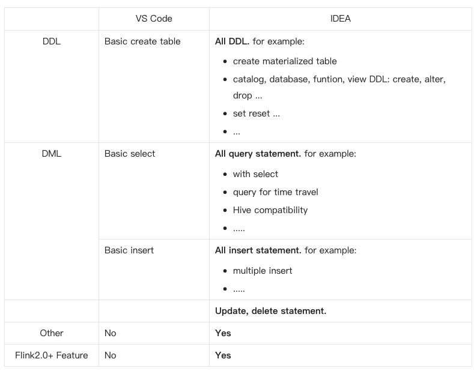

# Flink-SQL-Helper
一款帮助你更高效、专注开发FlinkSQL的插件。支持FlinkSQL(v1.20.0)的语法校验提示、代码高亮、关键字补全、重命名、查找全部引用、代码格式化等。

反馈问题可以在QQ群`913711491` or 公众号后台反馈（欢迎关注我公众号一起学习大数据知识）。
 

> 如果你喜欢在IDEA中进行FlinkSQL的开发。我建议你使用[IDEA版的Flink SQL Helper](https://plugins.jetbrains.com/plugin/25912-flink-sql-helper)，它支持了最新版本的FlinkSQL所有语句，在VsCode插件的基础上，它的报错信息也更加清晰。
> 如果你喜欢在VsCode上开发，那么配合[VS Code官网里的Java环境配置](https://code.visualstudio.com/docs/java/java-debugging)也会很棒。

版本之间的差异见下面的介绍`VSCode plugin VS IDEA plugin`。

---

Help you efficiently and focus on FlinkSQL development. support FlinkSQL(v1.20.0) error grammar check, syntax highlighting, complete keywords, rename, find all references and code format.

> If you like develop Flink SQL in IDEA, you can use IDEA version of the plugin——[Flink SQL Helper](https://plugins.jetbrains.com/plugin/25912-flink-sql-helper), Its grammar error message is more powerful and supports the latest version of all FlinkSQL.
Or you like develop Flink SQL in VsCode. i suggest that you develop and debug on vscode based on [the information](https://code.visualstudio.com/docs/java/java-debugging) to obtain a better experience.

VSCode plugin VS IDEA plugin:
 

 
## 1.功能介绍(Features)

### 1.1 语法检测(Grammar Check)

语法检测将会在你保存时进行检测（强烈建议你关闭自动保存）。这个功能需要在配置中手动开启（默认不开启）：

Grammar check when you save edit (suggest you turn off automatic saving).the feature needs enabled in the configuration(not enabled by default)：

1. 
2. 

运行例子：

example:

- 
- 

### 1.2 重构(Refactorings)

### 1.3 代码补全(Code Completion Proposals)

### 1.4 快捷代码(Snippets)

可触发关键字(snippets keywords):

- create
- select
- insert
- join
- windows

#### create

#### select

#### insert

#### join

#### windows

### 1.5 查找所有的引用(Find All References)

### 1.5 查找引用(Show References)

### 1.7 代码格式化(Code Format)

## 2. 用户手册(User Guide)
如果你想让插件在你的FlinkSQL文件中生效，你的扩展名需要是`.fql`。

或者通过按F1，输入`Change Language Mode`，然后选择FlinkSQL。

Enable the extension on your Flink SQL file, either name the file with a extension `.fql` .
  
Or press F1, type 'Change Language Mode', and then choose FlinkSQL.

### 2.1 配色建议(Color theme recommend)

按F1, 选择`Preference: Color Theme`，然后复制下面的配色进去。

Press F1, choose `Preference: Open User Setting(JSON)` then paste:

~~~json
{
    "editor.tokenColorCustomizations": {
        "textMateRules": [
            {
                "scope": "keyword.control.flink",
                "settings": {
                    "foreground": "#559DD6"
                }
            },
            {
                "scope": "storage.type.flink",
                "settings": {
                    "foreground": "#C27432"
                }
            },
            {
                "scope": "support.type.flink",
                "settings": {
                    "foreground": "#C27432"
                }
            },
            {
                "scope": "constant.language.flink",
                "settings": {
                    "foreground": "#C27432"
                }
            },
            {
                "scope": "keyword.operator.arithmetic.flink",
                "settings": {
                    "foreground": "#F4BE6B"
                }
            },
            {
                "scope": "keyword.operator.relational.flink",
                "settings": {
                    "foreground": "#F0F400"
                }
            },
            {
                "scope": "keyword.operator.logical.flink",
                "settings": {
                    "foreground": "#C27432"
                }
            },      
            {
                "scope": "support.function.udf.complex.flink",
                "settings": {
                    "foreground": "#F2BC69"
                }
            },
            {
                "scope": "support.function.udf.mathematic.flink",
                "settings": {
                    "foreground": "#F2BC69"
                }
            },
            {
                "scope": "support.function.udf.type-cast.flink",
                "settings": {
                    "foreground": "#F2BC69"
                }
            },
            {
                "scope": "support.function.udf.date.flink",
                "settings": {
                    "foreground": "#F2BC69"
                }
            },
            {
                "scope": "support.function.udf.conditional.flink",
                "settings": {
                    "foreground": "#F2BC69"
                }
            },
            {
                "scope": "support.function.udf.string.flink",
                "settings": {
                    "foreground": "#F2BC69"
                }
            },
            {
                "scope": "support.function.udf.json.flink",
                "settings": {
                    "foreground": "#F2BC69"
                }
            },
            {
                "scope": "support.function.udf.value.construct.flink",
                "settings": {
                    "foreground": "#F2BC69"
                }
            },
            {
                "scope": "support.function.udf.value.access.flink",
                "settings": {
                    "foreground": "#F2BC69"
                }
            },
            {
                "scope": "support.function.udaf.flink",
                "settings": {
                    "foreground": "#F2BC69"
                }
            },
            {
                "scope": "support.function.udf.aggregate.flink",
                "settings": {
                    "foreground": "#F2BC69"
                }
            },
            {
                "scope": "support.function.udf.time.flink",
                "settings": {
                    "foreground": "#F2BC69"
                }
            },
            {
                "scope": "support.function.udf.column.flink",
                "settings": {
                    "foreground": "#F2BC69"
                }
            },
            {
                "scope": "support.function.time.attributes.flink",
                "settings": {
                    "foreground": "#F2BC69"
                }
            },
        ],
    }
}
~~~

我们提供了很多个选项，可以让开发者更好的定制自己的主题。如果你对主题有更多需求，可以查看 `syntaxes/flink.tmLanguage.json` 来了解关键字和配色映射。

We provide so many options to allow developers to better customize their favorite themes. if you want to deep in, please see the `syntaxes/flink.tmLanguage.json` to understand keyword and color theme mapping.