# Flink-SQL-Helper

Help you efficiently and focus on FlinkSQL development. support Flink SQL error grammar check, syntax highlighting, complete keywords, rename, find all references and code format, including user-defined functions.

> I suggest that you develop and debug on vscode based on the information (https://code.visualstudio.com/docs/java/java-debugging) to obtain a better experience.

## 1.Features

### 1.1 Grammar Check

Grammar check when you save edit (suggest you turn off automatic saving).

example:

- 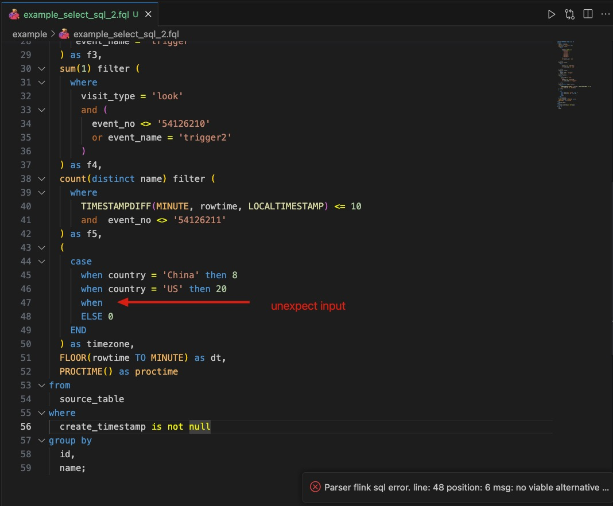
- 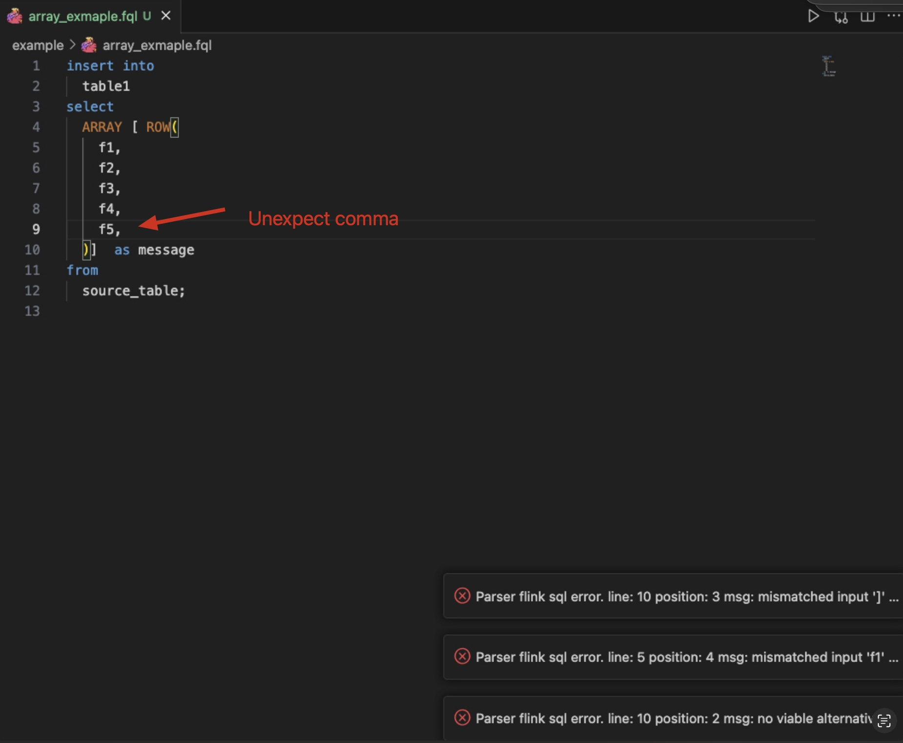
- 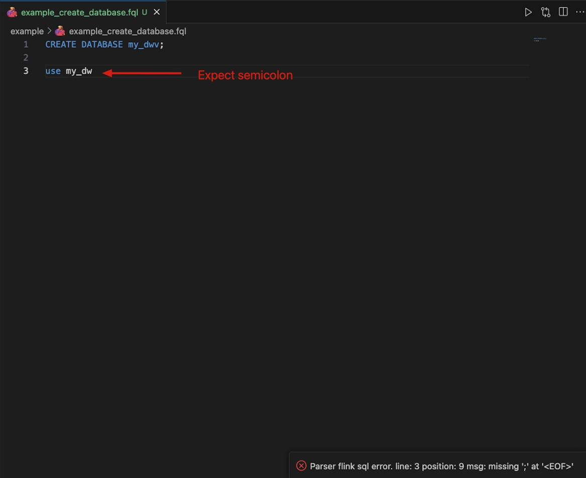

if you dont like the feature, you can setting config to turn off and show you how to change config:
1. 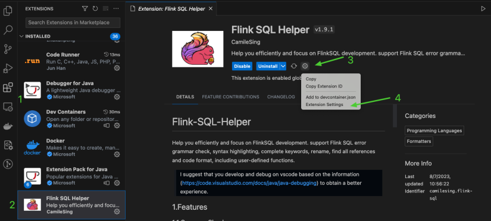
2. 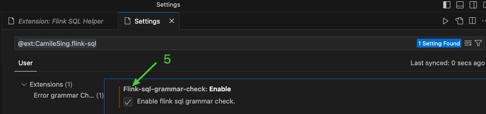

### 1.2 Refactorings

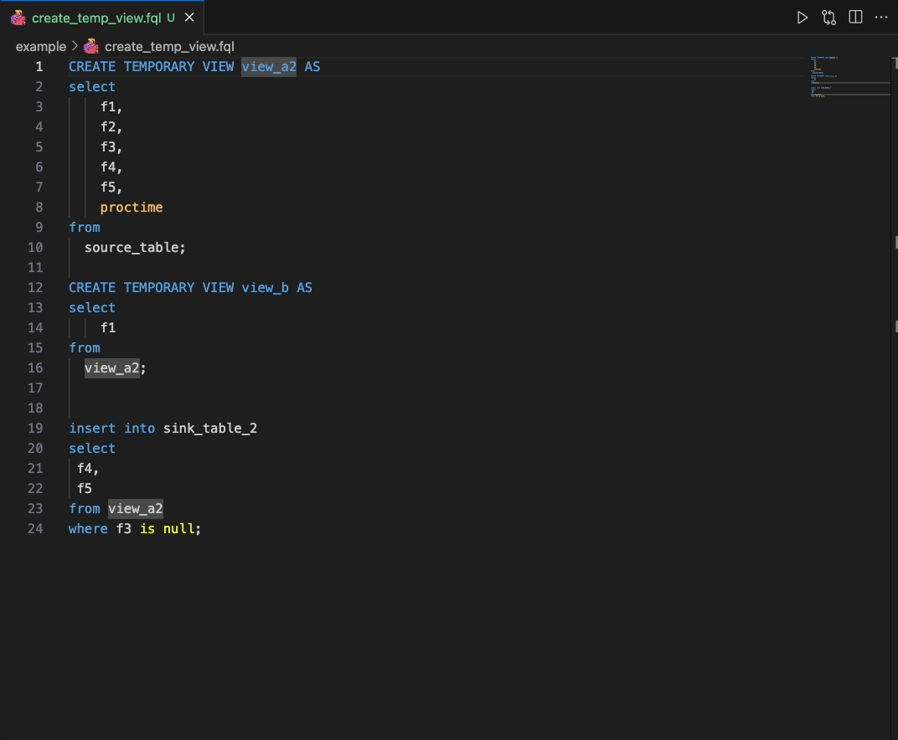

### 1.3 Code Completion Proposals

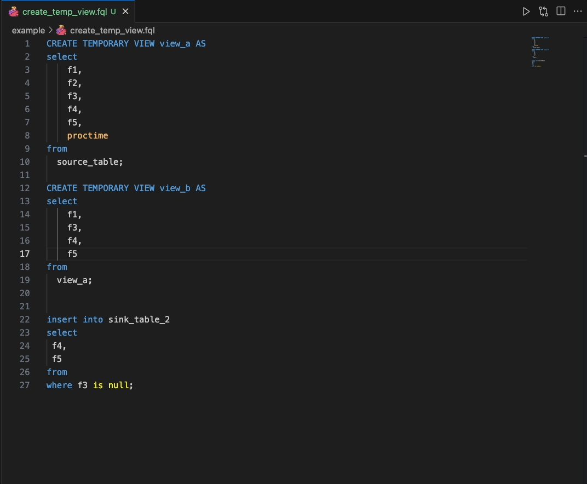

### 1.4 Snippets

snippets keywords:

- create
- select
- insert
- join
- windows

#### create

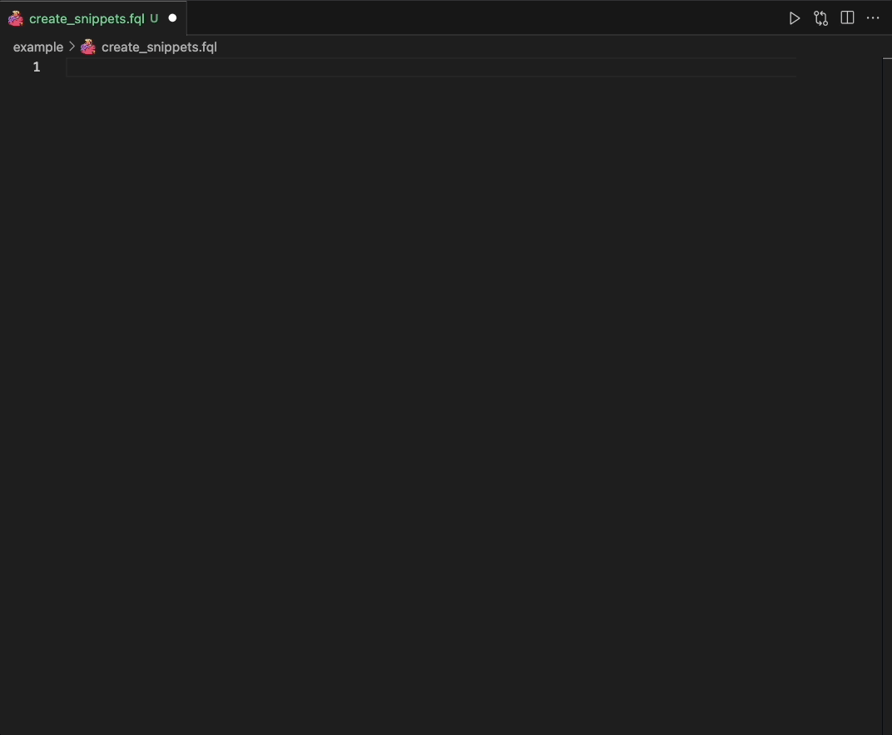

#### select

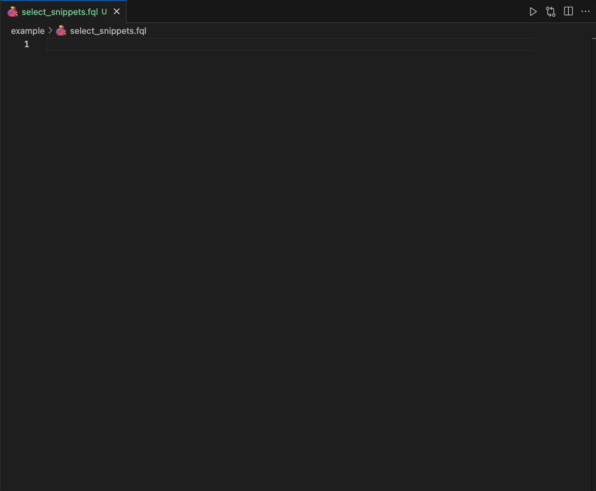

#### insert

#### join

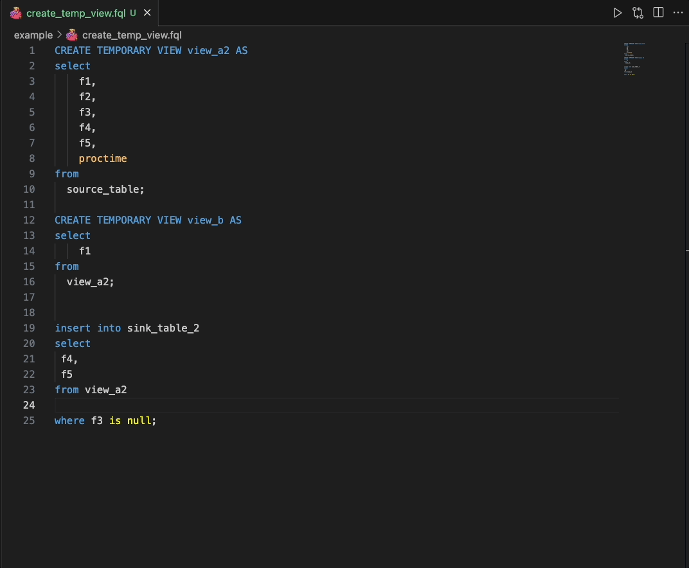

#### windows

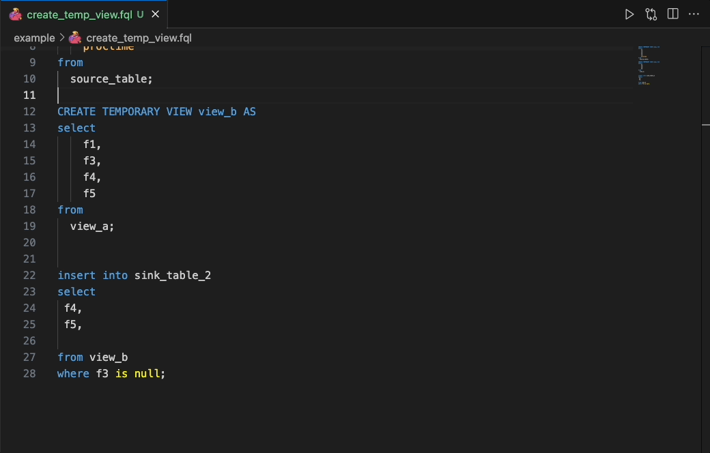

### 1.5 Find All References

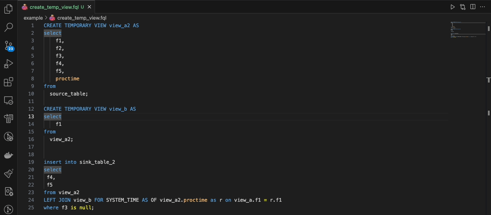

### 1.5 Show References

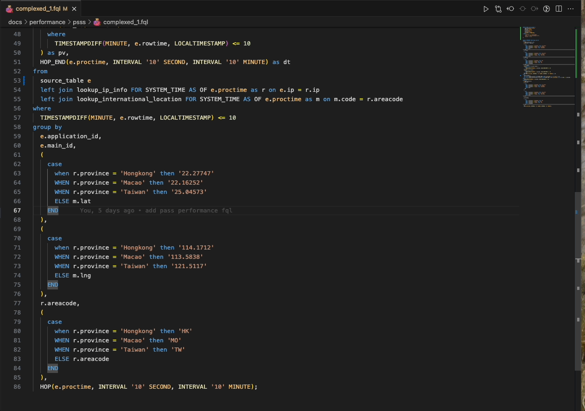

### 1.7 Code Format

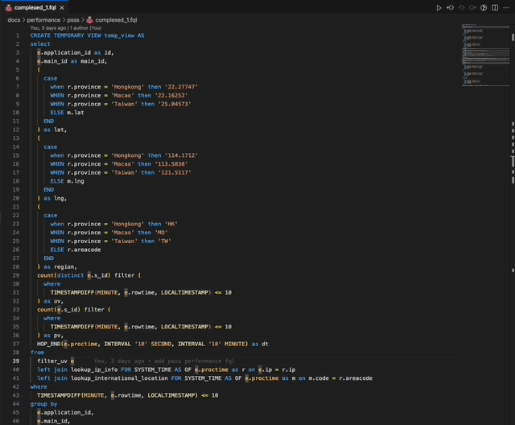

## 2. User Guide

Enable the extension on your file, either name the file with a extension:

- SQL
- FQL
  
Or press F1, type 'Change Language Mode', and then choose FlinkSQL.

### 2.1 Color theme recommend

Press F1, choose `Preference: Open User Setting(JSON)` then paste:

~~~json
{
    "editor.tokenColorCustomizations": {
        "textMateRules": [
            {
                "scope": "keyword.control.flink",
                "settings": {
                    "foreground": "#559DD6"
                }
            },
            {
                "scope": "storage.type.flink",
                "settings": {
                    "foreground": "#C27432"
                }
            },
            {
                "scope": "support.type.flink",
                "settings": {
                    "foreground": "#C27432"
                }
            },
            {
                "scope": "constant.language.flink",
                "settings": {
                    "foreground": "#C27432"
                }
            },
            {
                "scope": "keyword.operator.arithmetic.flink",
                "settings": {
                    "foreground": "#F4BE6B"
                }
            },
            {
                "scope": "keyword.operator.relational.flink",
                "settings": {
                    "foreground": "#F0F400"
                }
            },
            {
                "scope": "keyword.operator.logical.flink",
                "settings": {
                    "foreground": "#C27432"
                }
            },      
            {
                "scope": "support.function.udf.complex.flink",
                "settings": {
                    "foreground": "#F2BC69"
                }
            },
            {
                "scope": "support.function.udf.mathematic.flink",
                "settings": {
                    "foreground": "#F2BC69"
                }
            },
            {
                "scope": "support.function.udf.type-cast.flink",
                "settings": {
                    "foreground": "#F2BC69"
                }
            },
            {
                "scope": "support.function.udf.date.flink",
                "settings": {
                    "foreground": "#F2BC69"
                }
            },
            {
                "scope": "support.function.udf.conditional.flink",
                "settings": {
                    "foreground": "#F2BC69"
                }
            },
            {
                "scope": "support.function.udf.string.flink",
                "settings": {
                    "foreground": "#F2BC69"
                }
            },
            {
                "scope": "support.function.udf.json.flink",
                "settings": {
                    "foreground": "#F2BC69"
                }
            },
            {
                "scope": "support.function.udf.value.construct.flink",
                "settings": {
                    "foreground": "#F2BC69"
                }
            },
            {
                "scope": "support.function.udf.value.access.flink",
                "settings": {
                    "foreground": "#F2BC69"
                }
            },
            {
                "scope": "support.function.udaf.flink",
                "settings": {
                    "foreground": "#F2BC69"
                }
            },
            {
                "scope": "support.function.udf.aggregate.flink",
                "settings": {
                    "foreground": "#F2BC69"
                }
            },
            {
                "scope": "support.function.udf.time.flink",
                "settings": {
                    "foreground": "#F2BC69"
                }
            },
            {
                "scope": "support.function.udf.column.flink",
                "settings": {
                    "foreground": "#F2BC69"
                }
            },
            {
                "scope": "support.function.time.attributes.flink",
                "settings": {
                    "foreground": "#F2BC69"
                }
            },
        ],
    }
}
~~~

We provide so many options to allow developers to better customize their favorite themes. if you want to deep in, please see the `syntaxes/flink.tmLanguage.json` to understand keyword and color theme mapping.