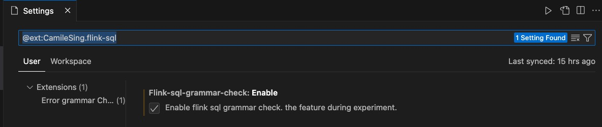
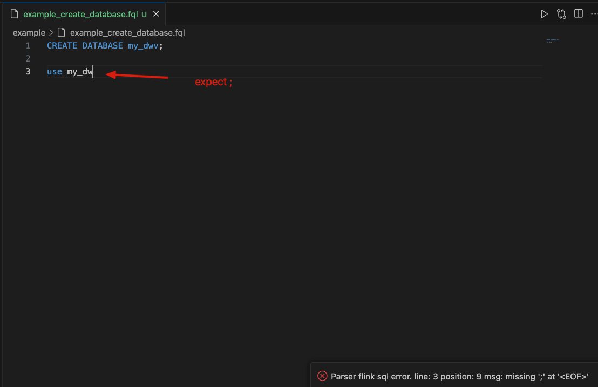
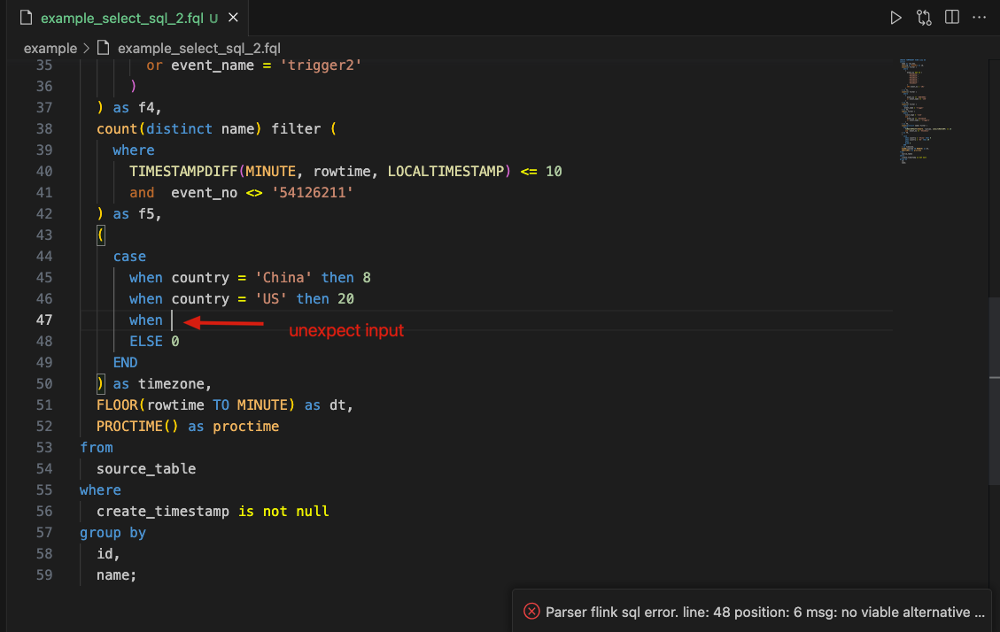
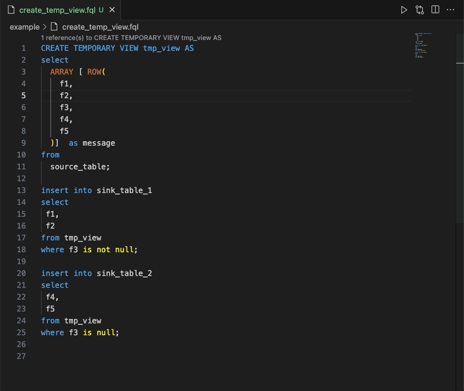
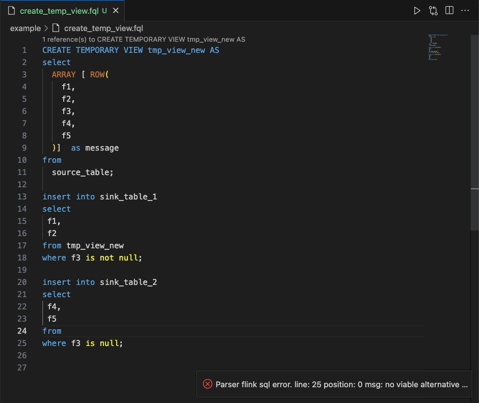
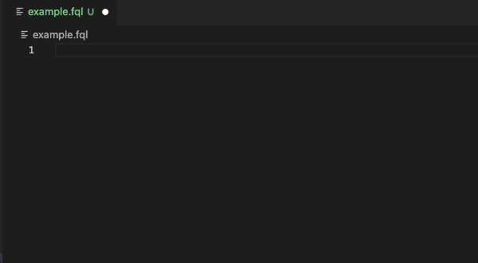

# Flink-SQL-Checker

This extension provides Flink SQL support for VSCode. Support Flink SQL error grammer check, syntax highlighting, complete keywords, rename and code format, including user-defined functions.


## 1.Features

### 1.1 Grammar Check
open your `setting.json`, add `"flink-sql-grammar-check.enable": true` or 


example:
- 

- 

- 

### 1.2 Rename


### 1.3 Code Completion Proposals


### 1.4 Snippets 
snippets keywords:
- create
- select
- insert



### 1.5 Code Format
Select your FlinkSQL code and press ```Alt+Shift+f```.

## 2. User Guide
Enable the extension on your file, either name the file with a extension:
- SQL
- FQL
  
Or press F1, type 'Change Language Mode', and then choose FlinkSQL.

### 2.1 Color theme recommend
~~~json
{
    "workbench.colorTheme": "Default Dark+",
    "editor.tokenColorCustomizations": {
        "textMateRules": [
            {
                "scope": "keyword.control.flink",
                "settings": {
                    "foreground": "#559DD6"
                }
            },
            {
                "scope": "storage.type.flink",
                "settings": {
                    "foreground": "#C27432"
                }
            },
            {
                "scope": "support.type.flink",
                "settings": {
                    "foreground": "#C27432"
                }
            },
            {
                "scope": "constant.language.flink",
                "settings": {
                    "foreground": "#C27432"
                }
            },
            {
                "scope": "keyword.operator.arithmetic.flink",
                "settings": {
                    "foreground": "#F4BE6B"
                }
            },
            {
                "scope": "keyword.operator.relational.flink",
                "settings": {
                    "foreground": "#F0F400"
                }
            },
            {
                "scope": "keyword.operator.logical.flink",
                "settings": {
                    "foreground": "#C27432"
                }
            },      
            {
                "scope": "support.function.udf.complex.flink",
                "settings": {
                    "foreground": "#F2BC69"
                }
            },
            {
                "scope": "support.function.udf.mathematic.flink",
                "settings": {
                    "foreground": "#F2BC69"
                }
            },
            {
                "scope": "support.function.udf.type-cast.flink",
                "settings": {
                    "foreground": "#F2BC69"
                }
            },
            {
                "scope": "support.function.udf.date.flink",
                "settings": {
                    "foreground": "#F2BC69"
                }
            },
            {
                "scope": "support.function.udf.conditional.flink",
                "settings": {
                    "foreground": "#F2BC69"
                }
            },
            {
                "scope": "support.function.udf.string.flink",
                "settings": {
                    "foreground": "#F2BC69"
                }
            },
            {
                "scope": "support.function.udf.json.flink",
                "settings": {
                    "foreground": "#F2BC69"
                }
            },
            {
                "scope": "support.function.udf.value.construct.flink",
                "settings": {
                    "foreground": "#F2BC69"
                }
            },
            {
                "scope": "support.function.udf.value.access.flink",
                "settings": {
                    "foreground": "#F2BC69"
                }
            },
            {
                "scope": "support.function.udaf.flink",
                "settings": {
                    "foreground": "#F2BC69"
                }
            },
            {
                "scope": "support.function.udf.aggregate.flink",
                "settings": {
                    "foreground": "#F2BC69"
                }
            },
            {
                "scope": "support.function.udf.time.flink",
                "settings": {
                    "foreground": "#F2BC69"
                }
            },
            {
                "scope": "support.function.udf.column.flink",
                "settings": {
                    "foreground": "#F2BC69"
                }
            },
            {
                "scope": "support.function.time.attributes.flink",
                "settings": {
                    "foreground": "#F2BC69"
                }
            },
        ],
    }
}
~~~